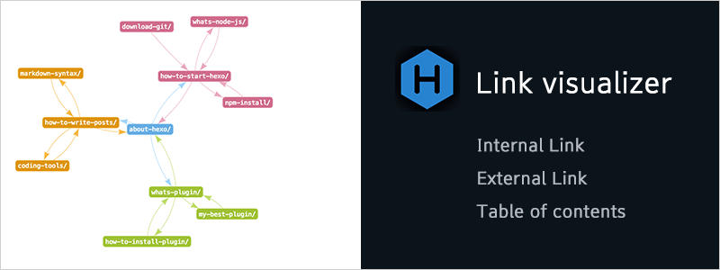

# hexo-seo-link-visualizer

Analyze link and visualize the site structure for [Hexo](https://github.com/hexojs/hexo) . [Show Article Map for WordPress](https://www.naenote.net/entry/show-article-map) you gave me was very helpful :)



## Overview

Plugin analyze internal links and external links and Table of Contents in your site. This plugin can be used to visualize internal link and find quickly problems for site structure.

## Installation

``` bash
$ npm install hexo-seo-link-visualizer --save
```

## Usage

First of all , you should to add npm script. Please insert as follow code at `package.json`.

```
"scripts": {
    "show-article-map": "node node_modules/hexo-seo-link-visualizer/app/show-article-map.js"
},
```

Next , Please run server and excute npm script. (`$ hexo clean` be sure to run.)

```
$ hexo clean
$ hexo server
$ npm run show-article-map
```

Last , Please run server of link visualizer. Since the default URL is `localhost:1234`, open this URL.

## Options

You can change plugin settings with as follow option. Please edit `_config.yml`.

```
# hexo-seo-link-visualizer's option
seoLinkVisualizer:
  enable: true
  cache: cache/seo-link-visualizer.json
  port: 1234
  previewHost: localhost:4000/
  categoryDepthLimits: 1    
  allowedSourcePath:
    - _posts/
    # - _drafts
  ignoreLink:
    int:
    ext:
      - amazon
      - amz
      - flickr
    toc:
```

- `enable`

    You can enable or disable this plugin.  Default value is `true`.
    
- `cache`

    The location of the file to save the analysis data. Default location is `/seo-link-visualizer.json`.

- `port`

    Port of link visualizer page. Default port is `1234`(localhost:1234).

- `previewHost`

    The address of the hexo's local server. Default url is `localhost:4000/`
    
- `categoryDepthLimits`

    The depth limit of the category to parse. The deeper the category, the more color-coded. Default value is `1`. With `0` disables the restriction.

- `allowedSourcePath`

    Source directory of article to be analyzed. By default, all articles below `source/_posts` are parsed. When you do not want to analyze `source/_drafts`, explicitly specify `_posts/` with this option.

- `ignoreLink`

    Specify a character string that you do not want to analyze link.
    

## License

MIT
